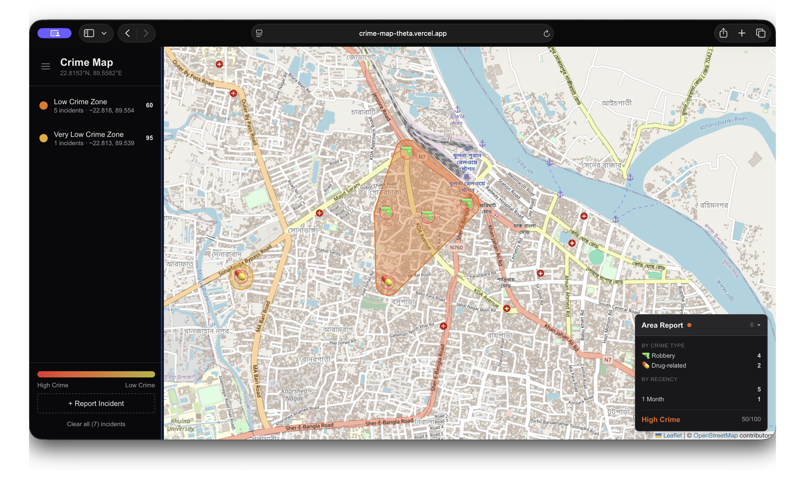

# Crime Map

> An interactive crime heatmap built with **Next.js 16**, **Leaflet**, and **MongoDB**. Report incidents by clicking the map — nearby reports auto‑cluster into color‑coded polygons using an amber‑red heat spectrum.

<p align="center">
  
</p>

<p align="center">
  <a href="https://crime-map-theta.vercel.app" target="_blank">
    
  </a>
  
  
  
  
  
</p>

---

## Features

| Feature | Description |
|---|---|
| **Click‑to‑report** | Tap anywhere on the map — a popup lets you select crime type and recency, then places the marker |
| **Emoji markers** | Each incident shows a crime‑type emoji instead of a generic dot |
| **Auto‑clustering** | Incidents within ~110 m group together and form a convex‑hull polygon |
| **Heatmap coloring** | Polygons are shaded amber → orange → red by incident density (never green — fewer crimes ≠ safe) |
| **Dual‑radius view** | Each incident displays a primary radius (visible zone) and a secondary radius (used for polygon computation) |
| **Dynamic sidebar** | Location label updates as you pan/zoom; cluster list filters to only what's visible in the viewport |
| **Area Report card** | Floating bottom‑right card shows live stats — count by type, recency breakdown, overall area score — filtered to the current viewport |
| **Persistent storage** | Incidents are stored in MongoDB and survive page reloads |

## Tech Stack

| Layer | Technology |
|---|---|
| **Framework** | [Next.js 16](https://nextjs.org/) (App Router) |
| **Language** | [TypeScript 5](https://www.typescriptlang.org/) |
| **Styling** | [Tailwind CSS 4](https://tailwindcss.com/) |
| **Map** | [Leaflet 1.9](https://leafletjs.com/) + [React‑Leaflet 5](https://react-leaflet.js.org/) |
| **Database** | [MongoDB 7](https://www.mongodb.com/) (native `mongodb` driver) |
| **Deployment** | [Vercel](https://vercel.com/) |

## Getting Started

### Prerequisites

- **Node.js** >= 18
- A **MongoDB** instance — [Atlas](https://www.mongodb.com/atlas) (free tier) or local

### Setup

```bash
git clone https://github.com/<your-org>/crime-map.git
cd crime-map
npm install
```

Create a `.env` file in the project root:

```env
MONGODB_URI=mongodb+srv://<user>:<password>@<cluster>.mongodb.net/?appName=<name>
DB_NAME=crime-map
```

Start the development server:

```bash
npm run dev
```

Open [http://localhost:3000](http://localhost:3000) in your browser.

### Scripts

| Command | Purpose |
|---|---|
| `npm run dev` | Start development server |
| `npm run build` | Production build |
| `npm run start` | Start production server |
| `npm run lint` | Run ESLint |

## How It Works

1. **Reporting** — Click **"+ Report Incident"** in the sidebar, then click the map. A popup appears asking for the crime type (with emoji) and recency (Today → Older).
2. **Clustering** — Every incident generates 12 buffer points around it at the secondary‑radius distance. Nearby incidents form groups using single‑linkage clustering.
3. **Polygon generation** — Each cluster's buffer points are fed through **Andrew's monotone‑chain convex‑hull** algorithm to produce the enclosing polygon.
4. **Coloring** — Absolute incident count determines the score using an amber‑red heat spectrum (red = dense, amber = sparse).
5. **Area Report card** — A floating card in the bottom‑right shows live statistics for the currently visible area, updating on every pan/zoom.
6. **Persistence** — Incidents are sent to MongoDB via the `/api/incidents` REST endpoint.

## API Endpoints

| Method | Path | Description |
|---|---|---|
| `GET` | `/api/incidents` | Fetch all incidents |
| `POST` | `/api/incidents` | Create a new incident |
| `DELETE` | `/api/incidents` | Clear all incidents |

## Environment Variables

| Variable | Required | Default | Description |
|---|---|---|---|
| `MONGODB_URI` | Yes | — | MongoDB connection string |
| `DB_NAME` | No | `crime-map` | Database name |

## Deployment

Designed for one‑click deployment on **Vercel**. Set `MONGODB_URI` and `DB_NAME` as environment variables in the Vercel dashboard or CLI:

```bash
vercel --prod
```

---

<p align="center">
  Built with <a href="https://nextjs.org/">Next.js</a>, <a href="https://leafletjs.com/">Leaflet</a>, and <a href="https://www.mongodb.com/">MongoDB</a>.
</p>
