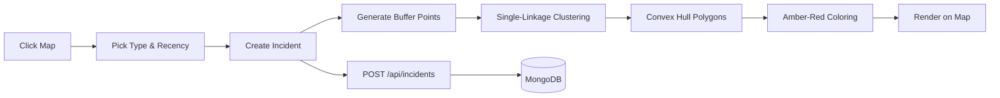

<div align="center">
  <br/>
  
  <br/>
  <br/>
  <h1>🚨 Crime Map</h1>
  <p>
    <strong>Interactive neighborhood‑aware crime heatmap</strong><br/>
    Click the map to report incidents. Nearby reports auto‑cluster into<br/>
    color‑coded polygons on an amber‑red heat spectrum.
  </p>
  <br/>
  <a href="https://crime-map-theta.vercel.app" target="_blank">
    
  </a>
  &nbsp;
  <a href="#getting-started">
    
  </a>
  <br/><br/>
  
  
  
  
  
  <br/><br/>
</div>

---

## ✨ Features

| | | |
|---|---|---|
| 🖱️ **Click‑to‑Report** | 📍 **Emoji Markers** | 🔗 **Auto‑Clustering** |
| Tap anywhere on the map — a smart popup lets you pick the crime type and recency, then drops the pin. | Every incident shows its own crime‑type emoji. No more generic dots. | Incidents within ~110 m merge into a single convex‑hull polygon. |
| 🌡️ **Heatmap Coloring** | 🔵 **Dual‑Radius View** | 📋 **Dynamic Sidebar** |
| Polygons shade amber → orange → red by density. (No green — fewer crimes ≠ "safe.") | Each incident reveals a primary radius (visible zone) and secondary radius (used for polygon math). | Location labels react to pan/zoom; the cluster list shows only what's on screen. |
| 📊 **Area Report Card** | 💾 **Persistent Storage** | 🚀 **Edge‑Ready** |
| A floating card in the bottom‑right serves live stats — counts by type, recency breakdown, area score — all filtered to the current viewport. | Incidents live in MongoDB and survive refreshes, reloads, and accidental tab‑closes. | Built on Next.js App Router, deployable to Vercel in one click. |

---

## 🧱 Tech Stack

```
Framework   │  Next.js 16 (App Router)
Language    │  TypeScript 5
Styling     │  Tailwind CSS 4
Maps        │  Leaflet 1.9 + React‑Leaflet 5
Database    │  MongoDB 7 (native driver)
Deploy      │  Vercel
```

---

## 🚀 Getting Started

### Prerequisites

- **Node.js** ≥ 18
- A **MongoDB** instance — [Atlas free tier](https://www.mongodb.com/atlas) works great

### Setup

```bash
# Clone the repo
git clone https://github.com/coder-wolf/crime-map.git
cd crime-map

# Install dependencies
npm install
```

Create a `.env` file in the project root:

```env
MONGODB_URI=mongodb+srv://<user>:<password>@<cluster>.mongodb.net/?appName=<name>
DB_NAME=crime-map
```

Fire up the dev server:

```bash
npm run dev
```

Open **[http://localhost:3000](http://localhost:3000)** and start dropping pins.

### Scripts

```bash
npm run dev       # Start the dev server
npm run build     # Production build
npm run start     # Start the production server
npm run lint      # Lint with ESLint
```

---

## ⚙️ How It Works



1. **Report** — Hit **"+ Report Incident"** in the sidebar, click the map, choose a crime type (emoji included) and recency (Today → Older).
2. **Buffer** — Each incident spawns 12 radial buffer points at the secondary‑radius distance.
3. **Cluster** — Buffer‑point overlap determines groups via single‑linkage clustering.
4. **Hull** — Each cluster's buffer points go through **Andrew's monotone‑chain convex‑hull** algorithm → a tight polygon.
5. **Color** — The absolute incident count maps to an amber‑red spectrum (denser = redder).
6. **Report Card** — A floating bottom‑right widget refreshes live stats on every pan/zoom.
7. **Save** — Incidents are persisted to MongoDB through the REST API.

---

## 📡 API

| Method | Endpoint | Description |
|---|---|---|
| `GET` | `/api/incidents` | Fetch all incidents |
| `POST` | `/api/incidents` | Create a new incident |
| `DELETE` | `/api/incidents` | Purge all incidents |

### Environment Variables

| Variable | Required | Default | Description |
|---|---|---|---|
| `MONGODB_URI` | ✅ Yes | — | MongoDB connection string |
| `DB_NAME` | ❌ No | `crime-map` | Database name |

---

## 🌐 Deployment

Push to Vercel in one command — set `MONGODB_URI` and `DB_NAME` as environment variables first.

```bash
vercel --prod
```

Or connect your Git repository in the [Vercel dashboard](https://vercel.com) — it'll auto‑deploy every push.

---

<div align="center">
  <br/>
  <sub>
    Built with ☕ &nbsp;·&nbsp;
    <a href="https://nextjs.org/">Next.js</a> &nbsp;·&nbsp;
    <a href="https://leafletjs.com/">Leaflet</a> &nbsp;·&nbsp;
    <a href="https://www.mongodb.com/">MongoDB</a>
  </sub>
  <br/>
  <br/>
  
</div>
